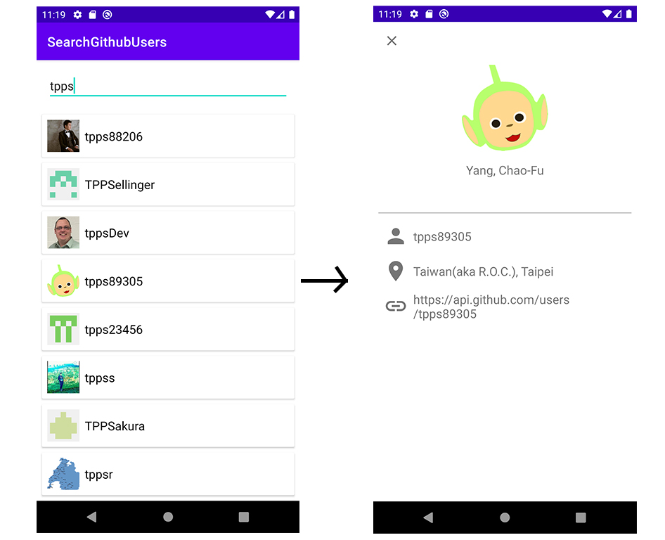

# Show GitHub All User App

An Android App which can search user(s) by keyword, and show user's detail.

## Overview
The App include two page, first page is search and show Github user(s) in list, second page is show information who selected from first page.

## Detail
These functions is implementation with MVVM architecture.

## Specification
- Build Tool: Android Studio 4.1.2
- Target Android Version: 10 (API Level 30)
- Language: Kotlin 1.4.10

## Third Party Plugin Used
- Retrofit2 2.5.0 with GsonConverter
- Coil 1.2.1

## Reference
### Implementing MVVM Development Mode in Android
- [Data Binding Library](https://developer.android.com/topic/libraries/data-binding)
- [Android TDD 系列 — 19 Android MVVM 架構:DataBinding (Chinese)](https://medium.com/evan-android-note/android-tdd-%E7%B3%BB%E5%88%97-19-android-mvvm-%E6%9E%B6%E6%A7%8B-databinding-1de161c3e1df)
- [Data Binding with RecyclerView & Custom setter (Chinese)](https://ithelp.ithome.com.tw/articles/10193830)
### Implementing DataBinding in Kotlin
- [Annotation Processing with Kotlin](https://kotlinlang.org/docs/reference/kapt.html)
- [Can not use BindingAdapter in Kotlin?](https://stackoverflow.com/questions/51875634/can-not-use-bindingadapter-in-kotlin)
### Other
- [View Binding](https://developer.android.com/topic/libraries/view-binding#kotlin)